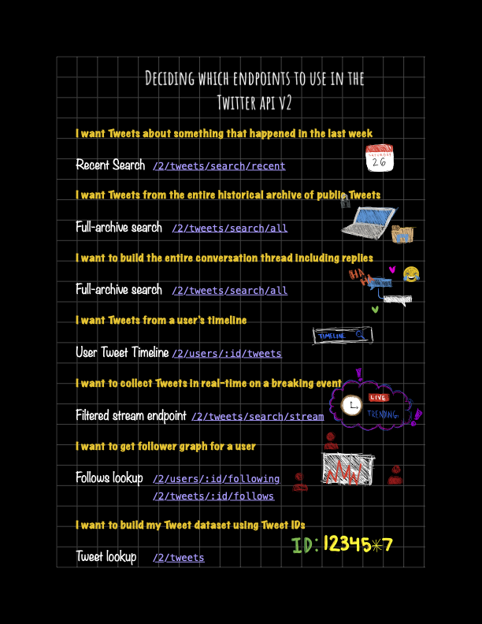

# Module 3: Deciding what endpoints to use, based on the data you need

The Twitter API provides different endpoints to get Tweets, based on your use-case. It is important to know which endpoint you should use, in order to get the right data. For example, if you want to get historical Tweets, you have the choice of using the [recent search endpoint](https://developer.twitter.com/en/docs/twitter-api/tweets/search/introduction) (if the Tweets are from the last 7 days) or the [full-archive search endpoint](https://developer.twitter.com/en/docs/twitter-api/tweets/search/quick-start/full-archive-search) (if the Tweets are older than that). You can not get this historical data using a streaming endpoint such as [filtered stream endpoint](https://developer.twitter.com/en/docs/twitter-api/tweets/filtered-stream/introduction), because that endpoint only provides Tweets in real-time, as they happen. Similarly, if you want to build your Tweet dataset from a list of Tweet IDs, you can use the [Tweet lookup endpoint](https://developer.twitter.com/en/docs/twitter-api/tweets/lookup/introduction).

Let us look at some use cases below, to learn which endpoints can best support those use-cases.

## I want to get Tweets about something that happened this past week

In order to get Tweets from the last 7 days, you can use the recent search endpoint and specify the keywords you want to search for. Additionally, you can use operators that let you narrow down your search (more on how to use these operators and build queries in module 5). This endpoint is available on the standard product track, so even if you don’t have access to the academic research product track, you can still get this data from the last 7 days. If you have access to the academic research product track, then you get additional operators as well as longer query length to use with this recent search endpoint.

*Fun fact:* By default, this endpoint returns 10 Tweets per request, and upto 100 Tweets per request using a max_results parameter. Thus, if you want 1000 Tweets, you will have to make 10 requests with max_results set to 100. However, many libraries and packages, including the ones we will be using for code samples in module 6, take care of making the API calls to the endpoints for you (behind the scenes) and get you the Tweets you need. Libraries and packages make it easy for you to get data from the Twitter API using functions. This reduces the amount of code you need to write in order to connect to the API and to get the API response and parse it.

[Learn how to get started with the recent search endpoint](https://developer.twitter.com/en/docs/twitter-api/tweets/search/introduction)

## I want to get Tweets on any topic from the entire historical archive of public Tweets

Let’s say you want to do research on the Twitter conversation around the outbreak of the coronavirus in December 2019. **Because that is over a year into the past, the recent search endpoint (mentioned above) will only be able to get Tweets about coronavirus for the last 7 days and you will not be able to get the original conversation from December 2019 using the recent search endpoint.** This is where the academic research product track comes in. You can use the full-archive search endpoint to get this data from the past (beyond the last 7 days), by specifying the keywords to search in your query and by limiting the time period using the start_time and end_time parameters. You can also narrow down your search by using operators.

[Learn how to get started with the full archive search endpoint](https://developer.twitter.com/en/docs/twitter-api/tweets/search/quick-start/full-archive-search)

## I want to build the entire conversation thread for a Tweet including replies

When searching for Tweets about a topic, researchers want to capture the entire conversation including the replies to a Tweet. The search endpoints in the Twitter API v2 support the conversation_id parameter that makes it easy for you to **build the entire conversation thread**.

- **If the conversation is from the last 7 days**, then you can use the recent search endpoint and specify the conversation ID and collect the full conversation.
- **For conversations older than 7 days**, you can use the full-archive search and specify the conversation ID in the query and specify the time period for the conversation using the start_time and end_time parameters.

[Learn more about getting the conversation threads using the Twitter API v2](https://developer.twitter.com/en/docs/twitter-api/conversation-id)

## I want to get Tweets from a user’s timeline

In some scenarios, you may want to get the public Tweets from a specific user’s timeline. For this use-case, you can use the [User Tweet timeline endpoint](https://developer.twitter.com/en/docs/twitter-api/tweets/timelines/introduction) that gives you up to 3200 most recent Tweets, Retweets, replies, and Quote Tweets for a user.

*Pro-tip:* If you want more than 3200 recent Tweets authored by a user, you can use the full-archive search endpoint and specify the username in your query using the from: operator e.g. from:TwitterDev and specify the time period for older Tweets. (we will learn how to do this in code in Module 6)

[Learn more about the User Tweet timeline endpoint](https://developer.twitter.com/en/docs/twitter-api/tweets/timelines/introduction)

## I want to collect Tweets in real-time on a breaking event

If you want to collect Tweets on a topic in real-time as people are Tweeting, you can use the [filtered stream endpoint](https://developer.twitter.com/en/docs/twitter-api/tweets/filtered-stream/introduction). This endpoint lets you set up rules which allow you to specify the keywords to track along with specifying other conditions to filter for the required data e.g. excluding retweets, including Tweets with media only etc.  If you have access to the academic research product track, you get 1000 concurrent rules that you can set to get the data you need, and each rule can be 1024 characters long. (In the standard product track, you get 25 rules and each rule can be 512 characters)

*Note: This endpoint differs from the search endpoint in terms of how the data can be collected. The filtered stream endpoint is a streaming endpoint that lets you stream for Tweets as they are happening whereas the search endpoints are historical endpoints that let you go back in time and get Tweets from the past.*

[Learn more about the filtered stream endpoint](https://developer.twitter.com/en/docs/twitter-api/tweets/filtered-stream/introduction)

## I want to get follower graph for a user

For use-cases around network analysis, you can use the [Follows lookup endpoints](https://developer.twitter.com/en/docs/twitter-api/users/follows/quick-start/follows-lookup), that let you explore the relationship between users. Currently, the Twitter API v2 supports the following and followers endpoints that let you look up this relationship between users.

[Learn how to get started with these follows lookup endpoints](https://developer.twitter.com/en/docs/twitter-api/users/follows/quick-start/follows-lookup)

## A fellow researcher shared a set of Tweet IDs and I want build the Twitter dataset for these Tweet IDs

The [Twitter developer policy](https://developer.twitter.com/en/developer-terms/policy) allows academics to share unlimited Tweet IDs for peer-review. If you have a list of these Tweet IDs and want to build the actual Tweet payload with the Tweet text and other fields, you can use the [Tweet lookup endpoints](https://developer.twitter.com/en/docs/twitter-api/tweets/lookup/introduction). You can lookup the Tweets using a single ID or using a list of IDs.

[Learn how to get started with the Tweet Lookup endpoints](https://developer.twitter.com/en/docs/twitter-api/tweets/lookup/introduction)

## What to do when you’ve identified the right endpoint(s) to use

In addition to identifying the right endpoint(s) to use for your research, you also want to make sure that you get the precise data that you need without bias and noise in your dataset. Being very specific here will help reduce the time you spend on post-processing the data, and also avoid taking valuable monthly Tweet volumes for data you do not need.
You should scope the data you plan to gather by asking questions like:

- Why do you need this data?
- What are you interested in? What are related keywords or hashtags?
- When is this information relevant, what time period are you focused on?
- Who are we interested in?
- Where are they? If this is global data, are your keywords global too?

Check out the initial section in this tutorial on [finding the right data](https://twitterdev.github.io/do_more_with_twitter_data/finding_the_right_data.html#finding-the-right-data), that showcases how you can narrow down your search and scope the data to ensure you have precisely the data you need without the need for having to remove Tweets in post-processing (after you have collected the initial set of Tweets).

You can always refer to this cheat sheet below which shows you the different endpoints to use based on your use-case:

  

In the next module, let us look at how we can get out API keys and tokens to connect to the Twitter API.

