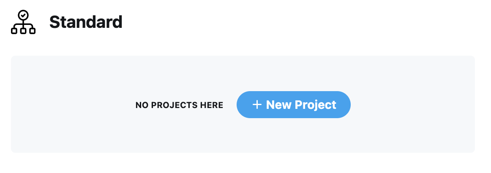
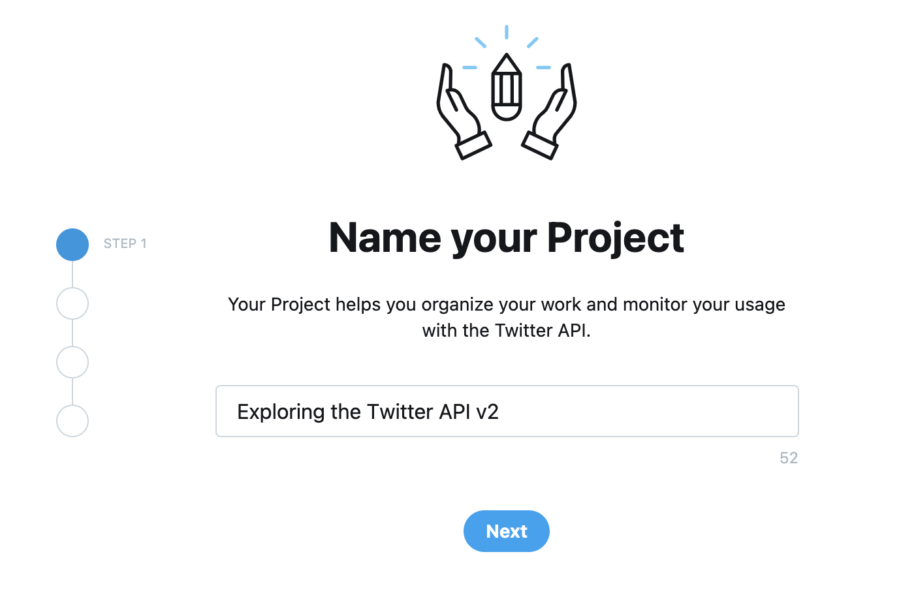
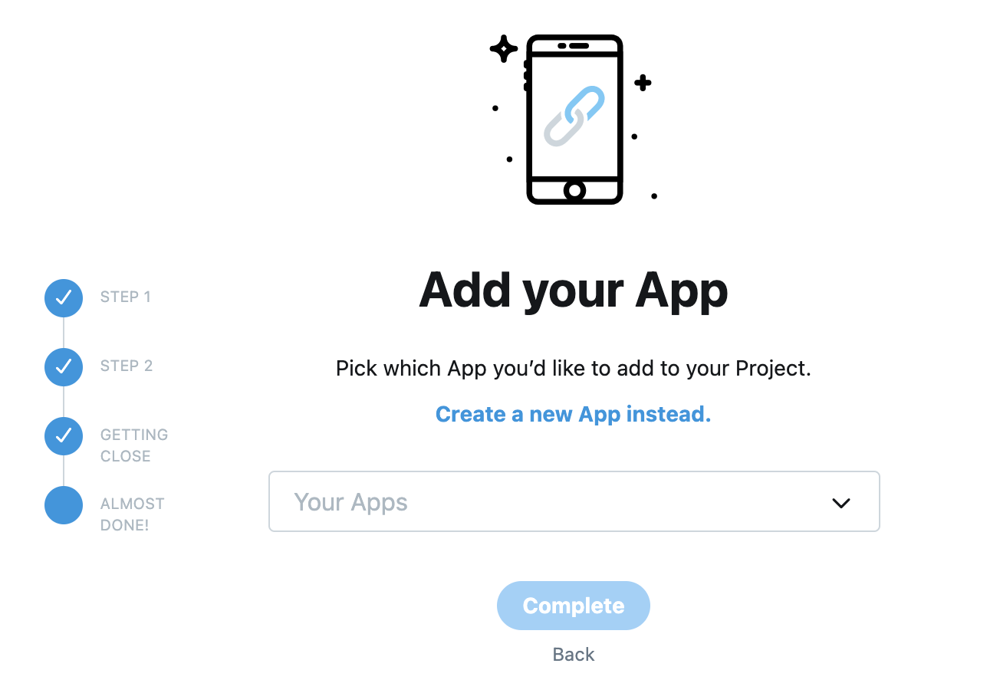
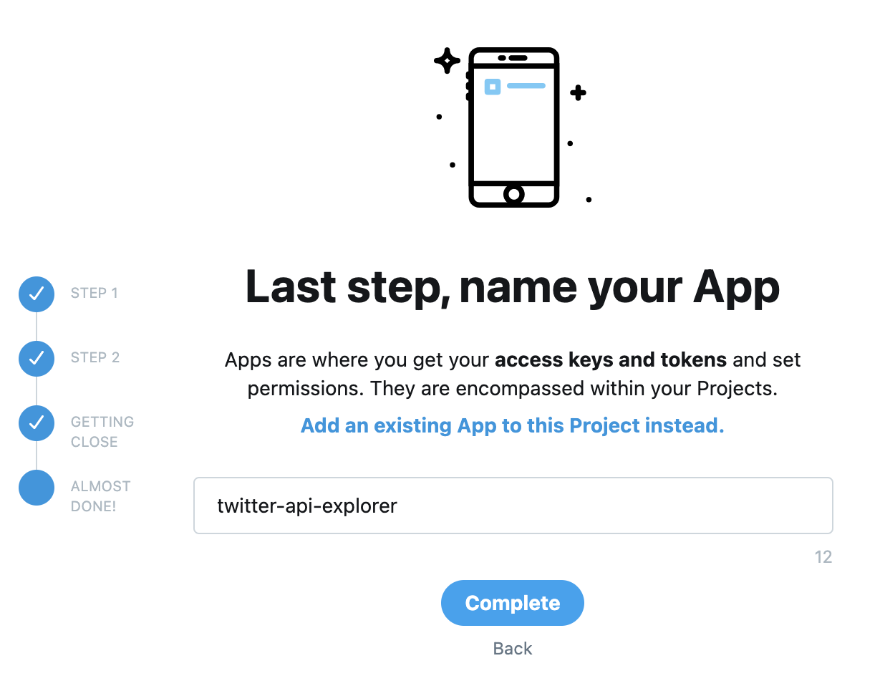
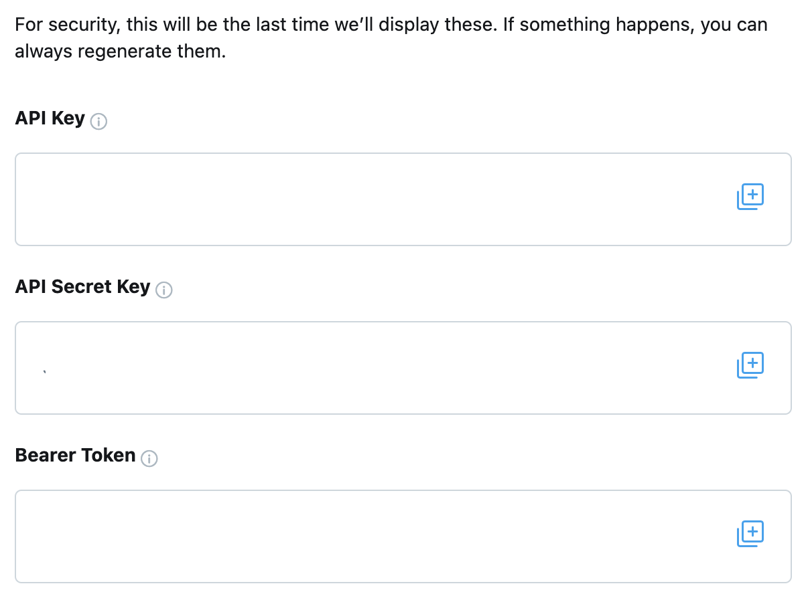
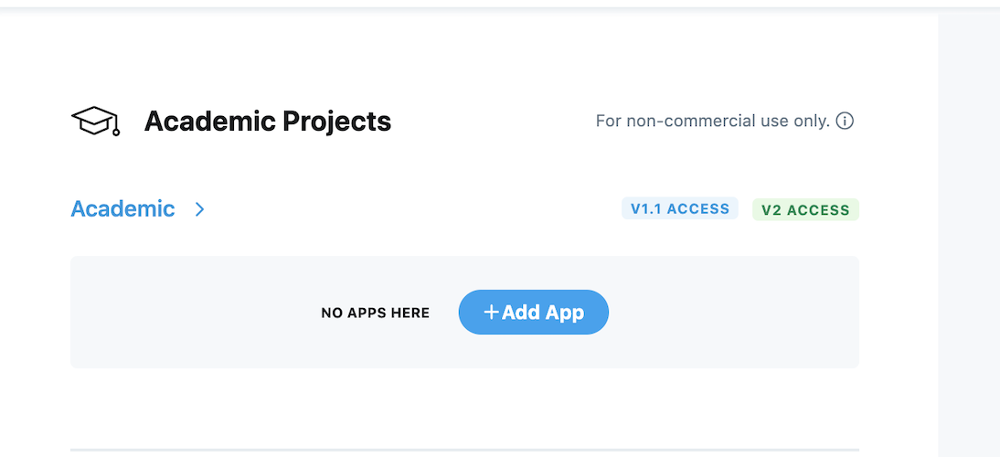

# Module 4: Getting your keys and bearer token from the developer dashboard

In order to use the Twitter API - whether directly via HTTP requests or via third-party libraries and packages - you will need your API keys and bearer token to use in your code. This section outlines how you can get your API keys and bearer token from the [developer portal dashboard](https://developer.twitter.com/en/portal/dashboard).

First: Go to the [developer portal](https://developer.twitter.com/en/portal/dashboard) and login.

The next steps vary based on your access. If you have access to the Standard product track, follow the steps below. If you have access to the Academic Research product track, then jump to the following section on using the Academic Research product track.

## Getting keys for the Standard product track

If you have access to the Standard product track, you will first need to create a new project.

Give it a name, select the appropriate use-case, provide a project description.

Next, you will need to connect an [app](https://developer.twitter.com/en/docs/apps/overview) to this project. An app is a container for your API keys that you need in order to make an HTTP request to the Twitter API. Click on ‘Add App’

Click ‘create a new App instead’ and give your app a name and click complete.

Once you click complete, you will get your API keys and the bearer token that you can then use to connect to the new endpoints in the Twitter API v2.

Click the (+) next to API key, API secret key and Bearer token and copy it in a safe place on your local machine, you will need these to use in your code (in Module 6)

**Note:** The keys in the screenshot above are hidden, but in your own developer portal, you will be able to see the actual values for the API key, API secret key and Bearer token.

## Getting keys for the Academic Research product track

If you have access to the Academic Research product track, your project is already created for you and you can see it in your developer dashboard.

Next, you will need to connect an app to this project. An app is a container for your API keys that you need in order to make an HTTP request to the Twitter API. Click on ‘Add App’

Click ‘create a new App instead’ and give your app a name and click complete.

Once you click complete, you will get your API keys and the bearer token that you can then use to connect to the new endpoints in the Twitter API v2.

Click the (+) next to API key, API secret key and Bearer token and copy it in a safe place on your local machine, you will need these to use in your code (in Module 6)

**Note:** The keys in the screenshot above are hidden, but in your own developer portal, you will be able to see the actual values for the API key, API secret key and Bearer token.

## Important note

The bearer token and keys from the standard product track and from the academic research product track are different. With the bearer token from the standard product track, you can only use the endpoints available in the standard product track. Hence, if you use a bearer token from this product track and try to use it to get Tweets from the full-archive search endpoint, you will get an error. Similarly, with this bearer token from the standard product track, if you try to use operators (in your search query) such as has:geo you will get an error message because those operators are only available in the academic research product track. So, if you want to use the full-archive search and the elevations for longer query length and additional operators, please use the correct bearer token from an app that is connected to your academic research project.

In order to get Tweets using the search endpoints in the Twitter API, you need to specify your request using a search query. In the next module, we will learn how to write search queries.

