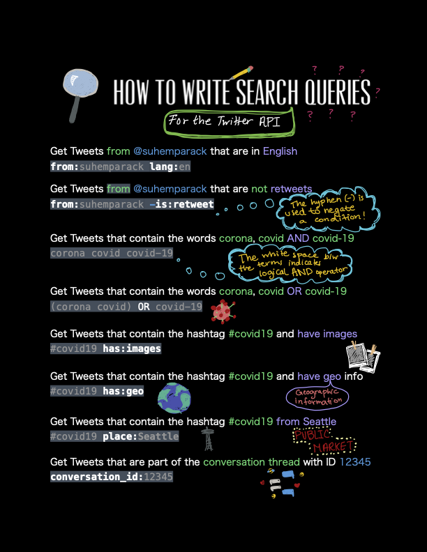

# Module 5: How to write search queries

In order to get Tweets for your research using the Twitter API, you need to specify what Tweets you are looking for. To do so, you need to write a search query (when using search endpoints) or set rules (when using the filtered stream endpoint). Both the search query and rules serve the same purpose of giving you the ability to describe the keywords and conditions for which you want Tweets.

A search query or rule can consist of a combination of standalone operators such as keywords and conjunction-required operators such as is:retweet. Standalone operators can be used by themselves or with other operators, whereas conjunction-related operators can not be used alone.

Below are some examples of search queries based on certain use-cases:

## Give me all Tweets from the TwitterDev account

`from:Twitterdev`

## Give me all Tweets that contain the words corona, coronavirus *and* covid-19

`corona coronavirus covid-19`

The space between the terms indicates logical AND operator

## Give me all Tweets that contain the words corona, coronavirus *or* covid-19

`corona coronavirus OR covid-19`

The logical AND between corona and coronavirus will be applied first followed by the logical OR of that with covid-19

## Give me all Tweets from the TwitterDev account that are not retweets

`from:TwitterDev -is:retweet`

The is:retweet operator filters for only those Tweets that are retweets and the ‘-’ indicates negation of this condition

## Give me all tweets of some different accounts

`(from:TwitterDev OR from:DevTwitter OR from:AnotherUser)`

It will be used with other queries like this:

`has:geo (from:TwitterDev OR from:DevTwitter OR from:AnotherUser) -is:retweet`

## Give me all Tweets that contain the word covid-19 and have geo data associated with them

`covid-19 has:geo`

## Give me all Tweets that are from Twitterdev and have images

`from:TwitterDev has:images`

## Give me all Tweets in the conversation thread with conversation_id 1394699198382043136

`conversation_id:1394699198382043136`

The conversation ID is the Tweet ID of the main Tweet for which you want all the replies. Because this Tweet is older than the last 30 days, you can only obtain it using the full-archive search endpoint. Additionally, you will also have to specify the start_time parameter otherwise you will not get any results back. An example of this is shown in the labs below in module 6.

## Give me all Tweets that contain the word covid-19 that are in the english language

`covid-19 lang:en`

**Note:** When AND and OR operators are used in a query or rule, the logical AND is calculated first, then the OR is applied. Also, as shown in the example above, if you want to negate an operator or condition, use a hyphen (-) before the operator. Negation is used to filter out keywords and conditions that you do not want your search query to match on.

## Operator availability and query length

When you use the recent search and full-archive endpoints as part of the Academic Research product track, your query length can be up to 1024 characters. In the Standard product track, you have access to the recent search endpoint and your query length can be up to 512 characters.

When you use the filtered stream endpoint as part of the Academic Research product track , you can set up to 1000 concurrent rules and each rule can be 1024 characters long. In the Standard product track, you can set 25 concurrent rules and each rule is 512 characters long.

See the complete list of operators supported by endpoints:

1. [Recent search and Full-archive search](https://developer.twitter.com/en/docs/twitter-api/tweets/search/integrate/build-a-query#availability)
2. [Filtered stream](https://developer.twitter.com/en/docs/twitter-api/tweets/filtered-stream/integrate/build-a-rule#availability)

In your code, make sure to use the bearer token from an App connected to a Project on the product track you wish to use, as this will impact the queries and filters you can create.

Operators that are only available in the academic research product for the recent search, full-archive search and filtered stream endpoints are listed below:

**Operator**|**Description**|**Recent & Full-archive Search**|**Filtered stream**
:-----|:-----|:-----:|:-----:
$|Matches any Tweet that contains the specified ‘cashtag’.|✅|✅
place|Matches Tweets tagged with the specified location or Twitter place ID|✅|✅
place_country|Matches Tweets where the country code associated with a tagged place/location matches the given ISO alpha-2 character code|✅|✅
point_radius|Matches against the place.geo.coordinates object of the Tweet when present, and in Twitter, against a place geo polygon, where the Place polygon is fully contained within the defined region|✅|✅
bounding_box|Matches against the place.geo.coordinates object of the Tweet when present, and in Twitter, against a place geo polygon, where the place polygon is fully contained within the defined region|✅|✅
-is:nullcast|removes Tweets created for promotion only on ads.twitter.com that have a "source":"Twitter for Advertisers (legacy)" or "source":"Twitter for Advertisers"|✅|✅
has:cashtags|Matches Tweets that contain a cashtag symbol (with a leading ‘$’ character. For example, $tag)|✅|✅
has:geo|Matches Tweets that have Tweet-specific geolocation data provided by the Twitter user|✅|✅
bio|Matches a keyword within the Tweet publisher's user bio name| |✅
bio_name|Matches a keyword within the Tweet publisher's user bio name| |✅
bio_location|Matches Tweets that are published by users whose location contains the specified keyword or phrase| |✅

You can always refer to this cheat sheet below with examples of operators and how to build search queries:

  

For best practices and detailed examples, check out our comprehensive [guide on building high quality filters to get Tweets](https://developer.twitter.com/content/developer-twitter/en/docs/tutorials/building-high-quality-filters).

Twitter building query document will be helpful: [Building queries for Search Tweets](https://developer.twitter.com/en/docs/twitter-api/tweets/search/integrate/build-a-query)

In the next module, we will look at code samples for getting Tweets using the [academicTwitteR](https://cran.r-project.org/web/packages/academictwitteR/index.html) package in R and the [twarc](https://github.com/DocNow/twarc) library in Python.

